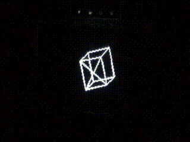
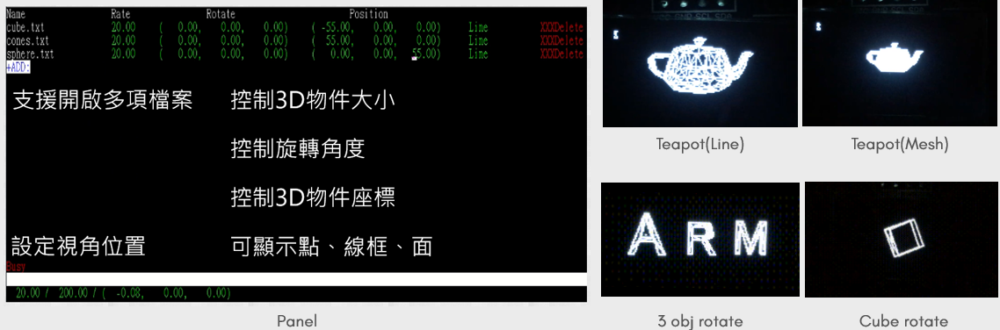

# OLED-3D-Display-on-Cortex-M0-
OLED 3D Display on Cortex M0+
* Use I2C to control OLED(SD1306)
* Fetch mesh data from .stl 3D file on computer
* Use UART transfer data between board and computer
* Implement control panel and 3D operation
# Demo

